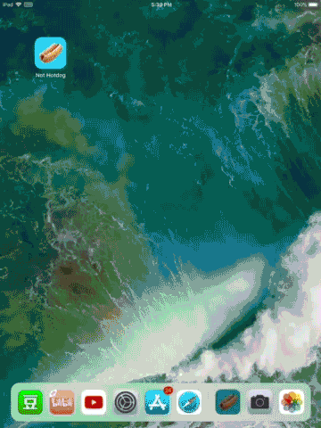
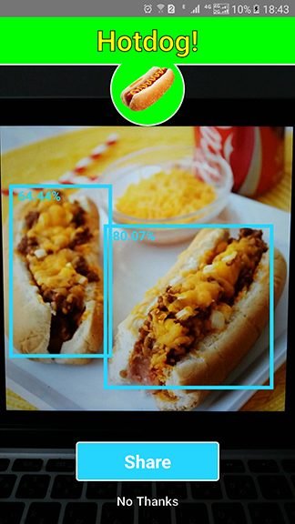

# Not Hotdog

应用开发使用:

* [React Native](https://facebook.github.io/react-native/) | [Flutter](https://flutter.io/) | Javascript
* [TensorFlow Mobile](https://www.tensorflow.org/mobile/mobile_intro)

模型训练使用:

* [Yolo v2 Tiny](https://pjreddie.com/darknet/yolov2/)

## 链接

* [建模过程](#建模过程)
* **[React Native 应用](#React-Native-应用)**
* **[Flutter 应用](#Flutter-应用)**
* **[Javascript PWA](#Javascript-PWA)**

---

## 效果图


**是时候表演真正的技术了**  —— 画框



## 建模过程

### 1. 制作数据集

偷懒用了 [COCO 2014](http://cocodataset.org/#download) 数据集。COCO 一共有 80 种物体类别，其中一个就是热狗 (hot dog)。我写了个脚本导出所有的热狗图片（共 1200 多张）并生成 yolo 格式的标注：
https://github.com/shaqian/Not-Hotdog/blob/master/yolo/coco2yolo.py

### 2. 训练 Yolov2 Tiny

使用的是 [darknet](https://github.com/pjreddie/darknet) 的  [这个 fork](https://github.com/AlexeyAB/darknet) 。

* 首先从预训练的 [yolov2 tiny 模型](https://pjreddie.com/media/files/yolov2-tiny.weights) 提取初始 weights：
```
darknet.exe partial yolov2-tiny.cfg yolov2-tiny.weights yolov2-tiny.conv.13 13
```

* 然后整理数据集，主要是生成 obj.data 和 obj.names 文件，可参考：
  https://timebutt.github.io/static/how-to-train-yolov2-to-detect-custom-objects/

* 修改 .cfg 文件：
 将原本的 80 个类别改成 1 个类别。.cfg 文件和初始 weights 请见 GitHub repo 。

* 最后训练模型：

```
darknet.exe detector train data\obj.data yolov2-tiny-hotdog.cfg yolov2-tiny.conv.13
```

### 3. 将 weights 转为 TensorFlow protobuf (.pb) 格式

我用的 [darkflow](https://github.com/thtrieu/darkflow) 转换：

```
flow --model ../yolov2-tiny-hotdog.cfg --load ../yolov2-tiny-hotdog_final.weights  --savepb
```

### 4. 量化

转换后的 .pb 约有 44MB。用 TensorFlow repo里面的 [quantization 脚本](https://github.com/tensorflow/tensorflow/tree/master/tensorflow/tools/quantization) 压缩一下，体积可以减小到 11MB。

```
python3 tensorflow/tools/quantization/quantize_graph.py --input=yolov2-tiny-hotdog.pb --output_node_names=output --output=quantized_yolov2-tiny-hotdog.pb --mode=weights
```

## React Native 应用

### Native 模块

调用 TensorFlow Mobile 接口是自己实现的 native 模块。

* iOS 端的实现代码在

  ./react-native-NotHotdog/ios/NotHotdog/TensorflowManager.mm

* Android 端的实现代码在

  ./react-native-NotHotdog/android/app/src/main/java/com/nothotdog/tensorflowmanager

### 依赖库一览

* TensorFlow Mobile: [iOS](https://www.tensorflow.org/mobile/ios_build#using_cocoapods), [Android](https://www.tensorflow.org/mobile/android_build#adding_tensorflow_to_your_apps_using_android_studio)
* [react-native-camera](https://github.com/react-native-community/react-native-camera)
* [react-native-share](https://github.com/react-native-community/react-native-share)
* [react-native-fs](https://github.com/itinance/react-native-fs)
* [react-native-svg](https://github.com/react-native-community/react-native-svg)
* [react-native-animatable](https://github.com/oblador/react-native-animatable)

### 准备工作

将 *./yolo* 文件夹的 *quantized_yolov2-tiny-hotdog.pb* 复制至以下路径：

* react-native-NotHotdog/android/app/src/main/assets
* react-native-NotHotdog/ios/NotHotdog/data

### 安装依赖 

* iOS 的 TensorFlow Mobile 用 pod 安装：

```
cd react-native-NotHotdog/ios
pod install
```

* 安装其他依赖：

```
cd react-native-NotHotdog/
npm install
```

### 运行

#### iOS

* 模拟器：

```
react-native run-ios
```

* 真实设备：

  请参考 [Running your app on iOS devices]( https://facebook.github.io/react-native/docs/running-on-device.html#running-your-app-on-ios-devices)。

#### Android

> 由于 react-native-camera 的一些问题，Android 端拍照要比 iOS 慢很多，有时间可以改进一下。

* GitHub repo 里的 rn_hotdog.apk 可直接安装。

* 模拟器：

```
react-native run-android
```

* 真实设备：

  请参考 [Running your app on Android devices]( https://facebook.github.io/react-native/docs/running-on-device.html#running-your-app-on-android-devices)。


## Flutter 应用

### Native 模块

调用 TensorFlow Mobile 接口是自己实现的 native 模块。

* iOS 端的实现代码在

  flutter_nothotdog/ios/Runner/TensorFlow/

* Android 端的实现代码在 

  flutter_nothotdog/android/app/src/main/java/com/nothotdog/tensorflow/

### 依赖库一览

* TensorFlow Mobile: [iOS](https://www.tensorflow.org/mobile/ios_build#using_cocoapods), [Android](https://www.tensorflow.org/mobile/android_build#adding_tensorflow_to_your_apps_using_android_studio)
* [camera](https://pub.dartlang.org/packages/camera)
* [path_provider](https://pub.dartlang.org/packages/path_provider)
* [share](https://pub.dartlang.org/packages/share)

### 准备工作

将 *./yolo* 文件夹内的 *quantized_yolov2-tiny-hotdog.pb* 复制至以下路径：

* flutter_nothotdog/android/app/src/main/assets/
* flutter_nothotdog/ios/Runner/TensorFlow/

### 安装 

* iOS 端的 TensorFlow Mobile 使用 POD 安装：

```
cd flutter_nothotdog/ios
pod install
```

* 安装其他依赖:

```
cd flutter_nothotdog/
flutter packages get
```

### 运行 App

```
flutter run
```

#### Android 端: 

* 直接安装 flutter_nothotdog 文件夹内的 flutter_hotdog.apk。

## Javascript PWA

### 网址

> 点击预览图片可显示 box 和 score。

https://shaqian.github.io/Not-Hotdog/

### 依赖

* [tfjs](https://github.com/tensorflow/tfjs)
* [tfjs-yolo](https://github.com/shaqian/tfjs-yolo)

### 运行

#### 安装依赖

```
npm install
```

#### 本地开发

```
npm start
```

#### 打包

```
npm run build
```