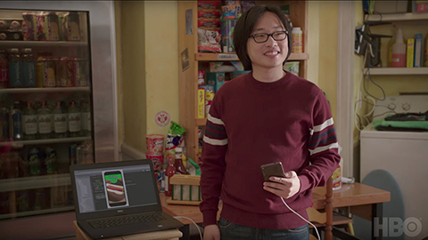

[中文文档](./README-CN.md)

# Not Hotdog

Personal implementation of Jin Yang's [Not Hotdog](https://itunes.apple.com/us/app/not-hotdog/id1212457521) app in HBO's Silicon Valley.



App developed with:

* [React Native](https://facebook.github.io/react-native/) |  [Flutter](https://flutter.io/)
* [TensorFlow Mobile](https://www.tensorflow.org/mobile/mobile_intro)

Model trained on:

* [Yolo v2 Tiny](https://pjreddie.com/darknet/yolov2/)

# Links

* [Building the Model](#Building-the-Model)
* **[React Native App](https://github.com/shaqian/Not-Hotdog/tree/master/react-native-NotHotdog)**
* **[Flutter App](https://github.com/shaqian/Not-Hotdog/tree/master/flutter_nothotdog)**

---

# Building the Model

### 1. Collecting data set

I used [COCO dataset 2014](http://cocodataset.org/#download) to train the model. COCO dataset contains 80 thing classes, one of which is "hot dog". 

I created a Python script (./yolo/coco2yolo.py) to extract all the hot dog images (800+ from train and 400+ from val) and convert the annotations to yolo format. 

### 2. Training Yolov2 Tiny

The model is trained with a single class "hotdog" using [this fork](https://github.com/AlexeyAB/darknet) of [darknet](https://github.com/pjreddie/darknet). 

* Extract weights from pre-trained [yolov2 tiny weights](https://pjreddie.com/media/files/yolov2-tiny.weights) with the original [yolov2-tiny.cfg](https://github.com/pjreddie/darknet/blob/master/cfg/yolov2-tiny.cfg):
```
darknet.exe partial yolov2-tiny.cfg yolov2-tiny.weights yolov2-tiny.conv.13 13
```

* Prepare the data files:

  Create obj.data and obj.names files as explained in:

  https://timebutt.github.io/static/how-to-train-yolov2-to-detect-custom-objects/

* Train model on the data set: 

> The .cfg file and initial weights can be found in ./yolo directory

```
darknet.exe detector train data\obj.data yolov2-tiny-hotdog.cfg yolov2-tiny.conv.13
```

### 3. Converting weights to TensorFlow protobuf (.pb)

The yolo weights is converted to TensorFlow model using [darkflow](https://github.com/thtrieu/darkflow):

```
flow --model ../yolov2-tiny-hotdog.cfg --load ../yolov2-tiny-hotdog_final.weights  --savepb
```

> The saved .pb file can be found in ./yolo directory.

### 4. Quantization

The saved .pb is about 44MB. I used the  [quantization script](https://github.com/tensorflow/tensorflow/tree/master/tensorflow/tools/quantization) in Tensorflow repo to quantize and reduced the size to 11MB.

```
python3 tensorflow/tools/quantization/quantize_graph.py --input=yolov2-tiny-hotdog.pb --output_node_names=output --output=quantized_yolov2-tiny-hotdog.pb --mode=weights
```

> The quantized .pb file can be found in ./react-native-NotHotdog/ios/NotHotdog/data directory.
