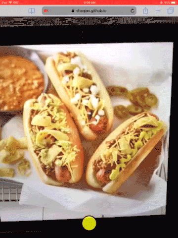

# Not Hotdog PWA

Detect hotdog in browser with [Tiny YOLO v2](https://pjreddie.com/darknet/yolov2/) and [TensorFlow.js](https://js.tensorflow.org/).

## Online demo

> Click on the preview image to see the boxes and scores.

https://shaqian.github.io/Not-Hotdog/



## Dependencies

* [tfjs](https://github.com/tensorflow/tfjs)
* [tfjs-yolo](https://github.com/shaqian/tfjs-yolo)

## Run the App

### Install Dependencies

```
npm install
```

### Build for development

```
npm start
```

### Build for production

```
npm run build
```

## Building the Model

https://github.com/shaqian/Not-Hotdog#building-the-model

- The tfjs model files are stored in ./dist/model/